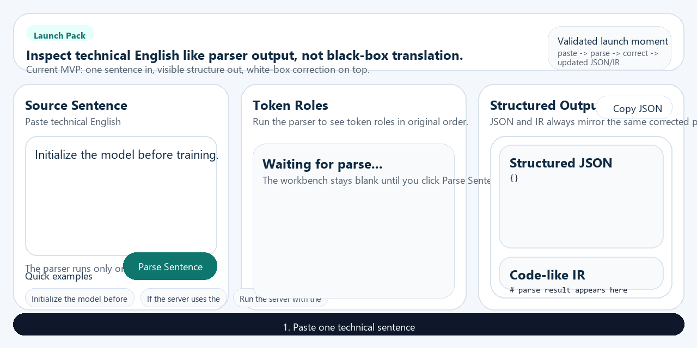

# English Decompiler

> Decompile English technical text into actions, objects, and control flow - so developers can inspect it instead of blindly translating it.

English Decompiler is a white-box parser for technical English.

It does not replace a sentence with a black-box translation.
It turns technical English into inspectable structure that developers can verify, reason about, and correct.



[Examples](./examples/launch-examples.json) | [Chinese README](./README.zh-CN.md) | [Roadmap](./ROADMAP.md) | [Contributing](./CONTRIBUTING.md)

## Why this exists

Some developers do not avoid English because they are lazy.

They avoid it because raw docs feel opaque, while full translation removes the reasoning process.

English Decompiler keeps the reasoning loop visible.

## What it does

- Highlights actions, objects, conditions, sequence, and purpose
- Parses technical English into a simple inspectable JSON structure
- Renders a code-like IR for developers
- Lets users verify and correct the parser instead of trusting a black box
- Focuses on GitHub READMEs, API docs, setup guides, and AI tooling docs

## Example

Input:

```text
Initialize the model before training.
```

Parsed structure:

```yaml
action: initialize
object: model
relation:
  type: sequence
  value: before
next_action: train
```

IR view:

```python
before(train):
  initialize(model)
```

## Why this is different from translation

Translation gives you an answer. Parsing gives you control.

## Launch Assets

- [Hero GIF](./assets/hero.gif)
- [Workbench overview](./assets/launch/demo-overview.png)
- [Correction loop](./assets/launch/correction-loop.png)
- [JSON + IR view](./assets/launch/json-ir-view.png)
- [Social preview](./assets/social-preview.png)

## Examples Corpus

The canonical launch examples live in [examples/launch-examples.json](./examples/launch-examples.json).

They stay sentence-first, technical-doc oriented, and scoped to the current MVP.

## Feedback

- [Report a bug](https://github.com/qloveyzdd/EnglishDecompiler/issues/new?template=bug_report.md)
- [Share a parser example](https://github.com/qloveyzdd/EnglishDecompiler/issues/new?template=parser_example.md)
- [Browse good first issues](https://github.com/qloveyzdd/EnglishDecompiler/issues?q=is%3Aopen+is%3Aissue+label%3A%22good+first+issue%22)

## Start in 30 seconds

```bash
pnpm install
pnpm dev
```

## Status

Experimental.
Optimized for technical English, not general conversation.
Not an English-learning tool and not a general translator.
